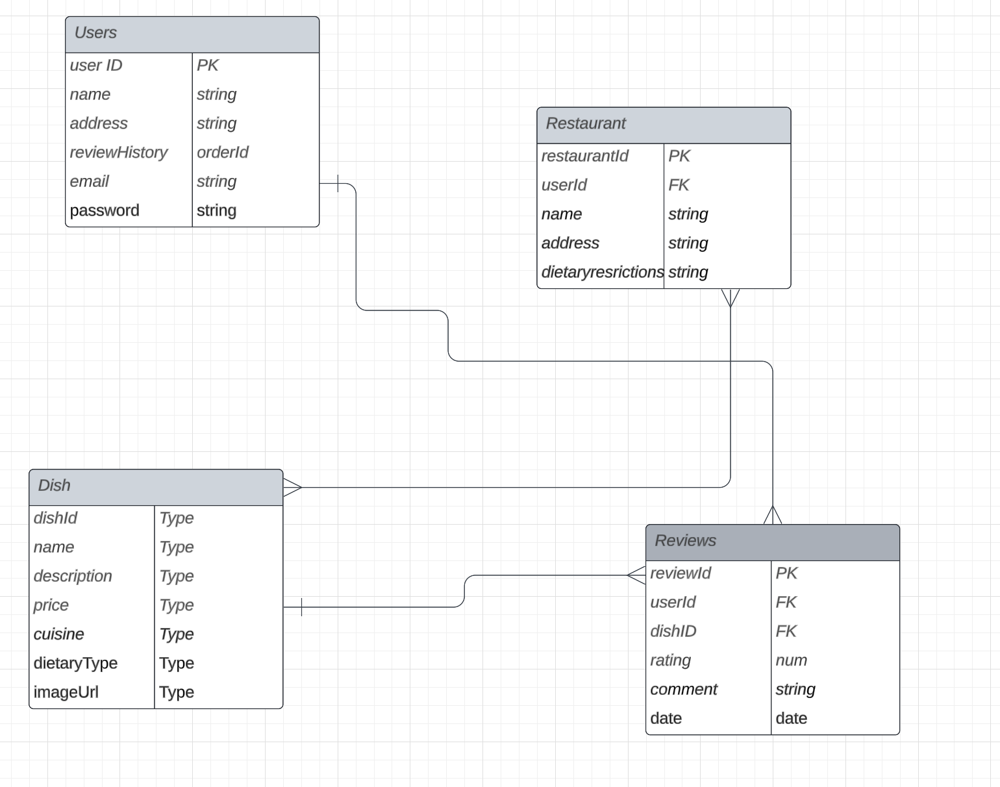

# SeeFood

## Features:
- Search functionality for specific dishes and or restaurants.
- Ability to see top-rated dishes in a particular area or cuisine.
- Filter reviews based on dish type, dietary restrictions.

## Planning
Github Repo: Create a new repository named **SeeFood**.

### ERD:
Entities: User, Review, Restaurant, Dish, (maybe) Cuisine.

Relationships:
- A user can write many reviews.
- A restaurant can have many dishes.
- A dish can have many reviews.

### Wireframes:
The following are the wireframe details for the Homepage, Restaurant Page, Dish Page, Review Form, and User Profile:

1. **Homepage:**
    - **Header:** Logo on the left, navigation links (Home, Browse Restaurants, My Reviews, Profile, Login/Signup) on the right.
    - **Main Content:**
        - Large search bar in the center with placeholder text "Search for a dish or restaurant".
        - Below the search bar, display featured dishes or top-rated dishes with images, dish name, restaurant name, and average rating.
    - **Footer:** Links to About, Contact, Terms of Service, etc.

2. **Restaurant Page:**
    - **Header:** Same as the homepage.
    - **Main Content:**
        - Restaurant name, address, dietary accommodations, and a brief description at the top.
        - A list of dishes served by the restaurant. Each dish should have an image, name, average rating, and a link/button to view detailed reviews.
    - **Footer:** Same as the homepage.

3. **Dish Page:**
    - **Header:** Same as the homepage.
    - **Main Content:**
        - Dish name, image, dietary restrictions, and a brief description at the top.
        - Below, display user reviews for the dish. Each review should show the user's name, rating, and comment.
        - A button or link to "Write a Review" for the dish.
    - **Footer:** Same as the homepage.

4. **Review Form:**
    - **Header:** Same as the homepage.
    - **Main Content:**
        - Fields for rating (e.g., star selection or dropdown), comment box, and an optional field for uploading a photo of the dish.
        - Submit button to post the review.
    - **Footer:** Same as the homepage.

5. **User Profile:**
    - **Header:** Same as the homepage.
    - **Main Content:**
        - User details (name, email, profile picture) at the top.
        - Below, a list of the user's reviews. Each review should show the dish name, restaurant, rating, comment, and an option to edit or delete the review.
    - **Footer:** Same as the homepage.

### User Stories:
> "As a user, I want to search for a restaurant so that I can see their dishes."

> "As a user, I want to search for a dish so that I can see its reviews."

> "As a user, I want to write a review for a dish so that I can share my experience."

### MVP:
Basic user registration, ability to add reviews for dishes, search functionality for dishes/restaurants.

### Stretch Goals:
Advanced search filters, user profiles with their review history, top-rated dishes feature, integration with maps for restaurant or dish locations, dish recommendations based on user preferences.

## Development

### Backend:
- Set up Node, Express, and MongoDB.
- Design MongoDB schemas based on ERD.
- Implement CRUD operations for each model.

### Frontend:
- Design pages based on wireframes.
- Use Axios for making requests to my backend.
- Implement user interactions like adding reviews, and searching for dishes/restaurants.
- Styling: Use tasty visuals and ensure mobile-responsive.
